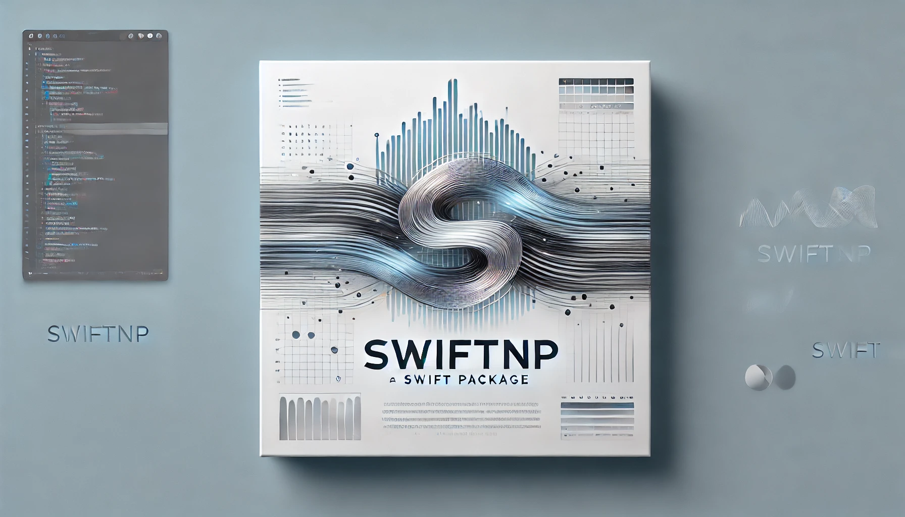

# SwiftNP

SwiftNP is a Swift package for numerical computing inspired by the popular Python library, NumPy. It provides support for multi-dimensional arrays (NDArray), along with basic operations on these arrays, such as reshaping, element-wise operations, and more.

## Features

- Multi-dimensional arrays (`NDArray`)
- Support for various numeric types (e.g., `Int`, `Float`, `Double`, etc.)
- Basic array operations (reshape, element-wise operations, etc.)
- Extensible architecture for additional numerical computing functionality

## Installation

### Swift Package Manager

Add the following to your `Package.swift` file:

```swift
dependencies: [
    .package(url: "https://github.com/k-arindam/SwiftNP", from: "0.0.5")
]
```

Then, include SwiftNP as a dependency in your target:

```swift
.target(
    name: "YourTarget",
    dependencies: ["SwiftNP"]),
```

Import SwiftNP

In any Swift file where you want to use SwiftNP:

```swift
import SwiftNP
```

## Usage

### Creating an NDArray

You can create a multi-dimensional array by specifying the shape and default values:

```swift
let array = SNP.ones(shape: [1, 3, 512, 512])
```

### Basic Array Operations

SwiftNP supports element-wise operations, reshaping, and much more:

```swift
let reshapedArray = array.reshape([1, 9])
```

### Data Types

SwiftNP supports a wide range of numeric data types. You can specify the data type when creating an NDArray:

```swift
let floatArray = NDArray(shape: [2, 2], dtype: .float64, defaultValue: 21.0)
```

## License

This project is licensed under the MIT License. See the LICENSE file for details.

*Banner generated by [ChatGPT](https://chat.openai.com/)*
